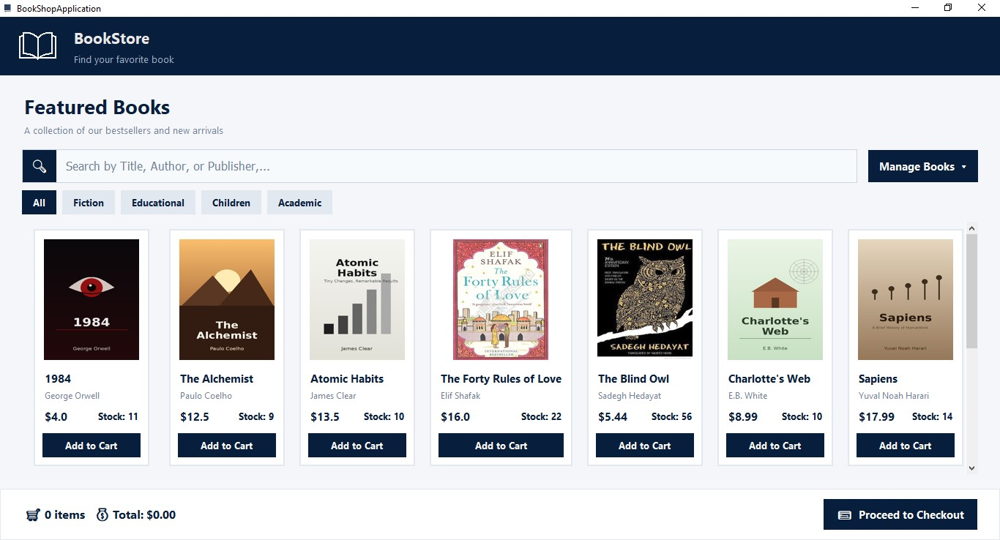

# 📚 BOOKSTORE APPLICATION | برنامه فروشگاه کتاب

A desktop bookstore management and sales application built with Python and Tkinter.
یک برنامه دسکتاپ مدیریت و فروش کتاب که با Python و Tkinter توسعه داده شده است.

---

# 📌 Features | امکانات

✅ Responsive Book Catalog (Card-Based Grid)  
✅ Search By Title, Author, or Publisher  
✅ Category Filtering  
✅ Shopping Cart With Quantity Control  
✅ Stock Validation Before Adding To Cart  
✅ Checkout Flow With Customer Information Form  
✅ Order Creation With Automatic Stock Reduction  
✅ Add / Edit / Delete Book Management Forms  
✅ Author, Publisher, and Category Selection Via Dropdowns  
✅ Layered Data Access (Author, Book, Publisher, Category, Customer, Order)  
✅ Scrollable Grid With Mouse Wheel Support  
✅ GUI Built Entirely With Tkinter and ttk Widgets  

✅ کاتالوگ کتاب به صورت گرید کارتی واکنش‌گرا  
✅ جستجو بر اساس عنوان، نویسنده یا ناشر  
✅ فیلتر کردن بر اساس دسته‌بندی  
✅ سبد خرید با امکان کنترل تعداد  
✅ بررسی موجودی قبل از افزودن به سبد خرید  
✅ فرآیند تسویه حساب همراه با فرم اطلاعات مشتری  
✅ ثبت سفارش و کسر خودکار موجودی  
✅ فرم‌های مدیریت کتاب برای افزودن، ویرایش و حذف  
✅ انتخاب نویسنده، ناشر و دسته‌بندی از طریق منوهای کشویی  
✅ لایه دسترسی به داده به‌صورت جدا (Author، Book، Publisher، Category، Customer، Order)  
✅ گرید قابل اسکرول با پشتیبانی از چرخ ماوس  
✅ رابط گرافیکی کامل با Tkinter و ویجت‌های ttk  

---

# 🛒 How It Works | نحوه کارکرد

Customers can browse the catalog, search or filter by category, and add books to their cart.
Each book's stock is checked before adding a new unit. At checkout, customer details are collected,
an order is created, and stock levels are updated automatically.

Store staff can add, edit, or delete books directly from the interface, selecting the author,
publisher, and category from dropdown lists populated from the database.

مشتریان می‌توانند کاتالوگ را مرور کنند، جستجو یا فیلتر بر اساس دسته‌بندی انجام دهند و کتاب‌ها را
به سبد خرید اضافه کنند. پیش از افزودن هر واحد، موجودی کتاب بررسی می‌شود. در مرحله تسویه حساب،
اطلاعات مشتری دریافت شده، سفارش ثبت می‌شود و موجودی به‌صورت خودکار به‌روزرسانی می‌شود.

کارکنان فروشگاه می‌توانند مستقیماً از طریق رابط کاربری، کتاب اضافه، ویرایش یا حذف کنند و نویسنده،
ناشر و دسته‌بندی را از فهرست‌های کشویی که از پایگاه داده پر می‌شوند انتخاب کنند.

---

# 🛠 Technologies Used | تکنولوژی‌های استفاده‌شده

- Python
- Tkinter / ttk
- Pillow (PIL) — image handling for book covers
- SQLite Database
- OOP Concepts
- Layered Architecture (Entities / DataAccess layers)
- Event Binding

---

# 📂 Project Structure | ساختار پروژه

```bash
BookShopApplication/
│
├── covers/
│   ├── 1984_cover.png
│   ├── alchemist_cover.png
│   ├── atomic_habits_cover.png
│   ├── charlottes_web_cover.png
│   ├── deep_work_cover.png
│   ├── FortyRulesofLove_cover.png
│   ├── python_crash_course_cover.jpeg
│   ├── sapiens_cover.png
│   └── the_blind_owl_cover.png
│
├── DataAccess/
│   ├── author_data_access.py
│   ├── book_data_access.py
│   ├── category_data_access.py
│   ├── customer_data_access.py
│   ├── order_data_access.py
│   └── publisher_data_access.py
│
├── Entities/
│   ├── author.py
│   ├── book.py
│   ├── category.py
│   ├── customer.py
│   ├── order.py
│   ├── order_item.py
│   └── publisher.py
│
├── book.png
├── bookicon.png
├── BookShopDB.db
│
└── main.py
```

---

# 🚀 How To Run | نحوه اجرا

Clone the repository:
```bash
git clone https://github.com/your-username/BookShopApplication.git
```

Open the project folder:
```bash
cd BookShopApplication
```

Run the application:
```bash
python main.py
```

---

# 🎥 Demo | دمو

### BookStore Screenshot



### Video Demo
ویدیوی دموی پروژه در LinkedIn منتشر شده است:

[Watch the demo on LinkedIn](https://www.linkedin.com/in/zahra-salimzadeh-5767582ab/)

---

# 👩‍💻 Developer | توسعه‌دهنده

**Zahra Salimzadeh**

- LinkedIn: [https://www.linkedin.com/in/zahra-salimzadeh-5767582ab/](https://www.linkedin.com/in/zahra-salimzadeh-5767582ab/)
- Email: zahrasalimzadeh7@gmail.com
